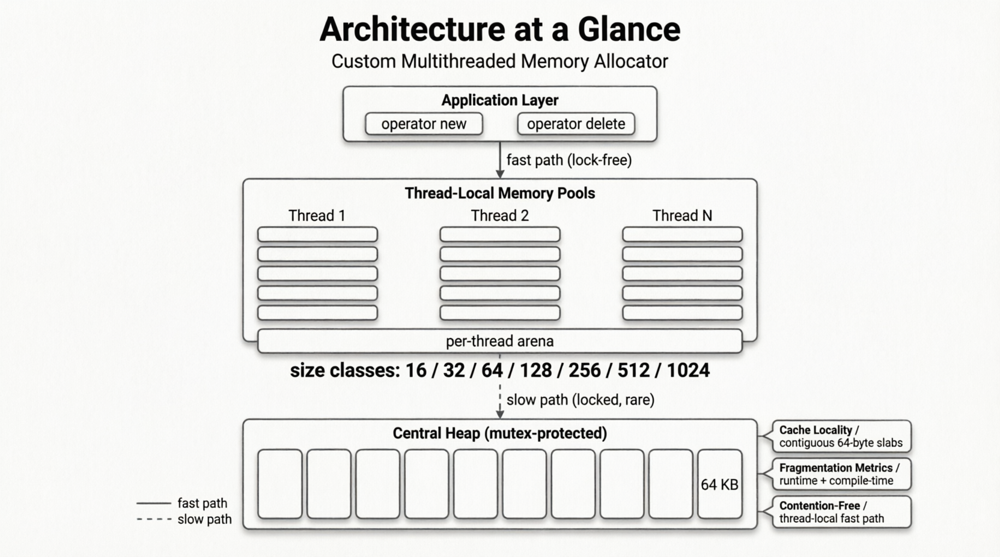
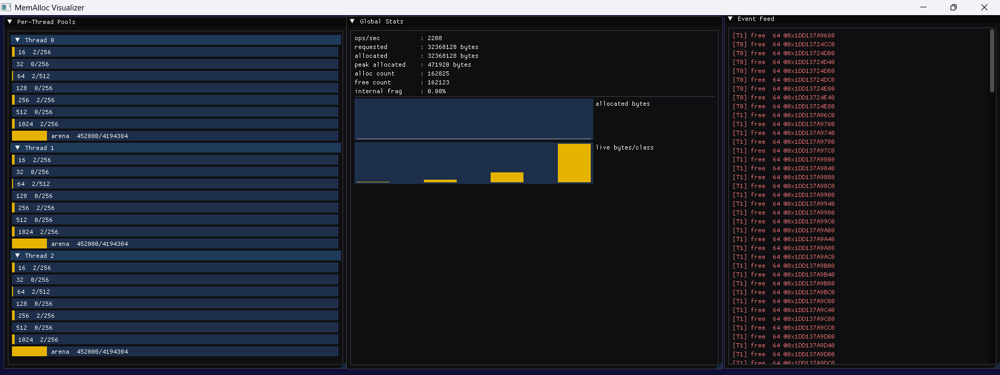

# MemAlloc — Custom Multithreaded Memory Allocator

A custom, multithreaded memory allocator for C++17: per-thread size-class
pools with a lock-free fast path, a central heap for refills, and a global
`operator new`/`delete` override.

## Overview

Most programs never think about `malloc` and pay for it. The system
allocator is general-purpose: it must serve any size, any alignment, from
any thread, and it defends against concurrent access with locks and
fine-grained binning. That generality costs latency and causes cache-line
ping-pong under multithreaded load.

MemAlloc is specialized instead. Small allocations (≤ 1 KiB) come from
fixed-size pools owned by the calling thread: the fast path is a single
free-list pop, no locks, no metadata search. Larger and over-aligned
requests ride a bump arena. When a thread exhausts a pool, it pulls a
64 KiB chunk from a shared central heap under one mutex — an amortized,
rare slow path. Internal fragmentation is measured at runtime and can also
be predicted at compile time for any type.

## Architecture



Allocation flows down through three layers. At the top, the global
`operator new`/`delete` overrides (`src/new_delete.cpp`) route every C++
allocation to the calling thread's `ThreadPoolAlloc` — a thread-local
object, so the fast path touches no shared state. `ThreadPoolAlloc` wraps a
`SingleThreadAllocator`, which routes small requests (≤ 1024 bytes) to one
of seven fixed-size `BlockPool`s (16–1024 bytes, doubling classes) and
larger requests to a bump `Arena`. When a pool runs dry, the
`SingleThreadAllocator` asks the chunk-source callback for a fresh slab;
the callback acquires a 64 KiB chunk from the `CentralHeap` under a single
mutex and links it into the pool's free list. Ownership is strict: the
`CentralHeap` owns every chunk it creates and frees them all at exit;
pools own only their constructor slabs and never free external chunks.

## Features

- **Per-thread lock-free fast path.** Every thread owns a
  `ThreadPoolAlloc` (`thread_local`), and the class is `alignas(64)` so
  each thread's hot allocator state occupies its own cache line — no false
  sharing, no locks on the common path.
- **Size-class routing + arena.** Small requests map to doubling size
  classes (16 → 1024) with embedded free lists (each free block stores the
  next free pointer inside its own memory); large/over-aligned requests
  ride a bump arena.
- **Central heap refill.** An exhausted pool pulls a 64 KiB chunk under one
  mutex — one lock per ~`BlocksPerSlab` allocations, so the slow path is
  amortized O(1).
- **Global `operator new`/`delete` override.** Link `src/new_delete.cpp`
  and every `new`/`delete` in the program (STL containers included) flows
  through MemAlloc, with bootstrap-safety before `main`.
- **Fragmentation metrics.** Runtime `Stats` aggregated globally plus a
  `constexpr` compile-time detector for any type.

## Project structure

```
memalloc/
├── CMakeLists.txt            # C++17; tests, bench, libs
├── LICENSE                   # MIT
├── README.md
├── include/
│   ├── arena.hpp             # bump allocator (large / over-aligned path)
│   ├── block_pool.hpp        # fixed-size pool, embedded free list
│   ├── central_heap.hpp      # 64 KiB chunks, mutex, address masking
│   ├── frag_detect.hpp       # compile-time fragmentation detector
│   ├── size_class.hpp        # size classes + constexpr block_for()
│   ├── single_thread_alloc.hpp  # pools tuple + arena + chunk source
│   ├── stats.hpp             # Stats, global registry, global_stats()
│   ├── thread_pool_alloc.hpp # thread-local front end (alignas(64))
│   └── viz_hook.hpp          # instrumentation ring for the visualizer
├── src/
│   ├── frag_report.cpp       # fragmentation report executable
│   ├── new_delete.cpp        # global operator new/delete overrides
│   └── thread_state.cpp      # per-thread guard flags (single TU)
├── tests/
│   ├── test_arena.cpp        # bump allocator edge cases
│   ├── test_block_pool.cpp   # free-list pool
│   ├── test_size_class.cpp   # constexpr routing + allocator
│   ├── test_threaded.cpp     # 8-thread churn + uniqueness
│   ├── test_new_override.cpp # new/delete override + refill phase
│   ├── test_frag.cpp         # fragmentation bounds
│   └── test_viz_hook.cpp     # viz instrumentation recording/occupancy
├── viz/
│   └── main.cpp              # optional ImGui visualizer (build-viz)
├── bench/
│   └── bench.cpp             # custom vs system allocator benchmarks
└── assets/
    ├── architecture.png
    ├── bench_results.txt
    └── viz_screenshot.png
```

## Build

CMake (Visual Studio generators, MinGW, Linux, macOS):

```sh
cmake -B build -DCMAKE_BUILD_TYPE=Release
cmake --build build
ctest --test-dir build        # Debug and Release: all 7 tests pass
```

Plain `g++` one-liners (Linux/macOS/MinGW):

```sh
# Tests. The allocator-only tests need just the headers; the threaded and
# override tests also compile the per-thread state TU (and, for the
# override test, the operator new/delete TU).
g++ -std=c++17 -O2 -pthread -Iinclude tests/test_arena.cpp src/thread_state.cpp -o test_arena
g++ -std=c++17 -O2 -pthread -Iinclude tests/test_block_pool.cpp src/thread_state.cpp -o test_block_pool
g++ -std=c++17 -O2 -pthread -Iinclude tests/test_size_class.cpp src/thread_state.cpp -o test_size_class
g++ -std=c++17 -O2 -pthread -Iinclude tests/test_threaded.cpp src/thread_state.cpp -o test_threaded
g++ -std=c++17 -O2 -pthread -Iinclude tests/test_new_override.cpp src/new_delete.cpp src/thread_state.cpp -o test_new_override
g++ -std=c++17 -O2 -pthread -Iinclude tests/test_frag.cpp src/thread_state.cpp -o test_frag

# Benchmark and fragmentation report
g++ -std=c++17 -O2 -pthread -Iinclude bench/bench.cpp src/thread_state.cpp -o bench
g++ -std=c++17 -O2 -pthread -Iinclude src/frag_report.cpp src/thread_state.cpp -o frag_report
```

## Usage

```cpp
#include "thread_pool_alloc.hpp"
#include <cstdio>
#include <string>

int main() {
    // Direct allocator API: per-thread pools, no locks on the fast path.
    memalloc::ThreadPoolAlloc& a = memalloc::ThreadPoolAlloc::instance();
    int* p = static_cast<int*>(a.allocate(sizeof(int)));
    *p = 42;
    a.deallocate(p, sizeof(int));

    // Or just use new/delete: link src/new_delete.cpp and every C++
    // allocation is routed through MemAlloc automatically.
    auto* s = new std::string("hello");
    std::printf("%s\n", s->c_str());
    delete s;
}
```

## Benchmark results

From `assets/bench_results.txt` (Windows, MSVC 1950, 12 logical cores,
Release `-O2`; `bench` links only the allocator core — no new/delete
override — so `std::malloc`/`::operator new` are the system allocators).
The `frag%` column is the custom allocator's runtime internal
fragmentation for that workload (delta of the `Stats` counters across the
run; `n/a` for the system allocators, which have no MemAlloc stats):

```
=== MemAlloc benchmarks ===
hardware_concurrency = 12
OS = Windows
compiler = MSVC (_MSC_VER=1950)
config = Release (-O2)

(a) single-thread alloc/free latency   (2000000 pairs, ns/op)
  allocator                       min     median    frag%
  ThreadPoolAlloc               11.64      12.44    0.00%
  std::malloc/free              40.84      42.75      n/a
  ::operator new/delete         41.05      46.50      n/a

(b) multi-thread scaling   (2000000 pairs total, split evenly)
  threads custom ns/op     custom speedup  malloc ns/op     malloc speedup  custom frag%
  1       12.05            1.15            41.96            0.97                  0.00%
  2       12.38            2.24            51.95            1.57                  0.00%
  4       17.30            3.21            68.23            2.39                  0.00%
  8       20.89            5.32            74.49            4.38                  0.00%

(c) cache-locality traversal   (500,000 x 64 B structs, ns/elem)
  path                            min     median    frag%
  ThreadPoolAlloc (slabs)       3.618      4.269    0.00%
  std::malloc (scattered)       5.233      5.434      n/a
```

The workloads request *exact* size classes (16/64/256/1024 bytes and a
64-byte struct), so rounding waste is 0% by construction — the frag% column
quantifies the allocator's tight fit at full speed. A mixed-size workload
shows the real rounding cost: `frag_report` measures ~17% on its
17/65/129/500/900-byte mix, matching the predicted (class−size)/class math.

MemAlloc wins where the design predicts: ~3.3–3.6x faster single-thread
latency (free-list pop/push beats malloc's metadata search and bin
bookkeeping) and better absolute per-op latency at every thread count
(per-thread pools never fight over a heap lock). The locality path is
~21–27% faster on traversal because blocks carved from contiguous slabs
prefetch and page-walk better than scattered malloc blocks. Both allocators
show per-op inflation at 8 threads — that is SMT sharing, since 8 workers
exceed the machine's 6 physical cores, not allocator contention: the
custom fast path shares no state between threads.

## Visualizer

An optional Dear ImGui + GLFW/OpenGL GUI (guarded by
`MEMALLOC_BUILD_VIZ=ON`, OFF by default so normal builds stay
dependency-free) shows the allocator working live. It links only the
allocator core — no `new`/`delete` override — and drives the demo
workload through `ThreadPoolAlloc` directly. Three windows render each
frame:

- **Global Stats** — aggregated `requested`/`allocated`/`peak`/counts, a
  smoothed alloc+free ops/sec readout, a rolling plot of allocated bytes,
  and a per-size-class histogram of live bytes.
- **Per-Thread Pools** — one collapsible section per live thread, with a
  used/cap bar for each of the seven size classes plus the arena.
- **Event Feed** — the most recent operations from the instrumentation ring
  (`viz_hook.hpp`): green `alloc`, red `free`, and YELLOW `chunk +64KiB`
  lines when a thread exhausts a pool and the central-heap slow path
  refills it.

Build and run (fetches GLFW 3.4 and Dear ImGui v1.90.9 via FetchContent —
internet required):

```sh
cmake -B build-viz -DMEMALLOC_BUILD_VIZ=ON
cmake --build build-viz --config Release
./build-viz/Release/memalloc_viz.exe
```



## Design analysis

**Complexity.** The fast path (allocate + deallocate) is O(1): pop or push
the free-list head plus two counter increments. Pointer classification for
the delete override walks the 7 pool regions and the arena, so it is O(7).
The slow path — a chunk refill — takes one mutex and links a fresh slab, so
it is amortized O(1) across the `BlocksPerSlab` allocations the slab
serves.

**Cache behavior.** Blocks are carved linearly from slabs, so same-class
objects allocated together are contiguous (the locality benchmark measures
this). Each thread's `ThreadPoolAlloc` is `alignas(64)` — a full cache
line — so cores never ping-pong allocator metadata (false-sharing
prevention).

**Concurrency model.** The fast path is lock-free by construction: all hot
state is thread-local. The only shared structures are the `CentralHeap`
(mutex held once per chunk acquisition, i.e. once per ~256 allocations) and
the stats registry (mutex at allocator construction/exit only).

## Fragmentation

Internal fragmentation — bytes lost to size-class rounding and alignment —
is measured two ways. At runtime, `SingleThreadAllocator` records
`requested` vs `allocated` bytes per operation into a `Stats` struct;
`memalloc::global_stats()` sums live and retired per-thread stats.
At compile time, `frag_detect.hpp` computes the worst-case per-allocation
fragmentation of any type: `compile_time_fragmentation<T>()` is `constexpr`
and can be used in `static_assert`s.

The classes double (16, 32, 64, …), so the worst case approaches 50%: a
request of `class/2 + 1` rounds up to the next class and wastes nearly half
the block. Types smaller than the smallest class fare worse — a `char`
(1 byte) in a 16-byte block wastes 15/16 = 93.75%. The runtime report
(`src/frag_report.cpp`) prints the compile-time table and the live
aggregated stats.

## Related work

MemAlloc occupies the same niche as the big three, scaled down. Like
**tcmalloc**, it uses per-thread caches with a central pool — but tcmalloc
adds a transfer cache that lets *other* threads' caches reclaim a
thread's freed memory; MemAlloc deliberately defers/leaks cross-thread
frees instead (see Limitations). Like **jemalloc**, it uses size classes
and separate regions per class — but jemalloc tracks occupancy with
bitmaps and pages (4 KiB), whereas MemAlloc links free blocks through
their own memory (no side metadata). Like **ptmalloc2** (glibc), it has
per-thread arenas — but ptmalloc still takes an arena lock per operation,
while MemAlloc's per-thread fast path is entirely lock-free.

## Limitations & future work

- **Cross-thread frees are deferred/leaked by contract.** A block freed on
  a thread other than its owner cannot safely join that thread's free list
  and is never freed individually (its slab/chunk memory is reclaimed at
  thread/process exit). A tcmalloc-style central transfer cache would
  reclaim it.
- **Small classes under-utilize 64 KiB chunks.** External slabs are capped
  at `BlocksPerSlab` (256) blocks even though a chunk could hold thousands
  of 16-byte blocks — a design simplification that wastes chunk space for
  the smallest classes.
- **No hugepage or NUMA awareness**, and arena memory is only released when
  the owning thread dies.

## Author

Built by Fusheini Abdul-Mumin.

## License

MIT — see [LICENSE](LICENSE). Copyright (c) 2026 Fusheini Abdul-Mumin.
